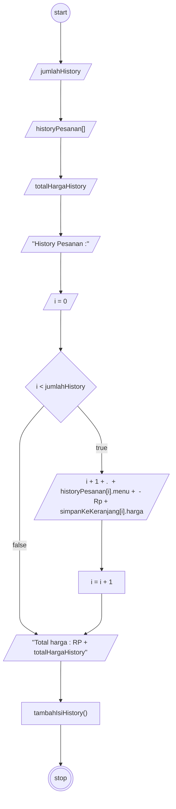

```mermaid
flowchart TB

start((start))
stop(((stop)))

let2[/"historyPesanan[]"/]

let1@{shape: lean-r, label: jumlahHistory}
let3@{shape: lean-r, label: totalHargaHistory}

pesan[/''History Pesanan :''/]
i@{shape: lean-r, label: i = 0}

while{i < jumlahHistory}

true1[/"i + 1 + .  + historyPesanan[i].menu +  - Rp + simpanKeKeranjang[i].harga"/]
iTambah@{shape: rect, label: i = i + 1}
log3[/''Total harga : RP + totalHargaHistory''/]
tambahIsiHisto["tambahIsiHistory()"]

start--->let1--->let2
let2--->let3--->pesan--->i
while--false--->log3
i--->while--true--->true1
true1--->iTambah--->log3

log3--->tambahIsiHisto--->stop


```
