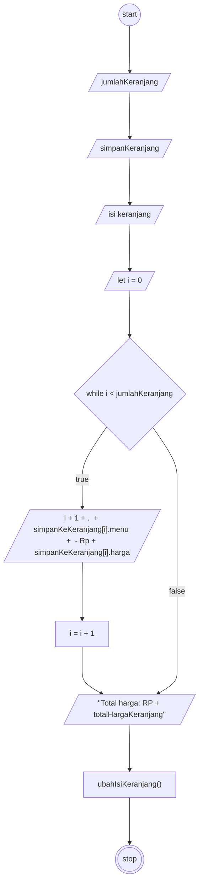

# flowchart Keranjang

```mermaid
flowchart TB

start((start))

stop(((stop)))

log1@{shape: lean-r, label: isi keranjang}

let1@{shape: lean-r , label: jumlahKeranjang}
let2@{shape: lean-r, label: simpanKeranjang}

letI@{shape: lean-r, label: let i = 0}

while@{shape: diamond, label: "while i < jumlahKeranjang"}

log2@{shape: lean-r, label: "i + 1 + .  + simpanKeKeranjang[i].menu +  - Rp + simpanKeKeranjang[i].harga"}

iTambah@{shape: rect, label: i = i + 1}

log3[/''Total harga: RP + totalHargaKeranjang''/]

isiKeran@{shape: rect, label: ubahIsiKeranjang() }


start--->let1--->let2
let2--->log1--->letI
letI--->while--true--->log2

log2--->iTambah--->log3
log3--->isiKeran--->stop
while--false--->log3


```
